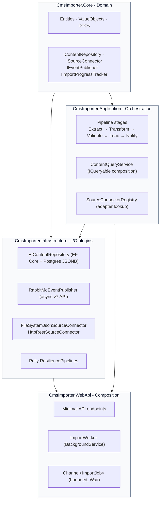
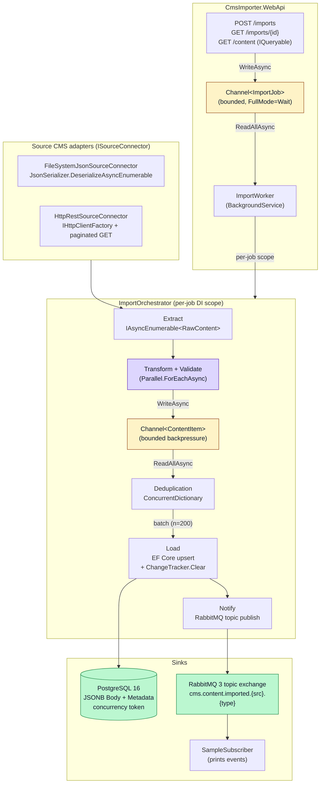

# CmsImporter

Take-home solution for below task:

**Provide a facility for customers to import their content from an existing WCMS into a new one, then notify upstream systems that the new content is available.**

**Architectural approach:** Clean Architecture layered solution with a streaming producer-consumer pipeline. Content is extracted lazily via `IAsyncEnumerable<T>`, transformed and validated in parallel, funnelled through bounded `Channel<T>` with backpressure, batch-upserted into PostgreSQL, and published as events using RabbitMQ without ever holding the full dataset in memory.

---

## Architecture

### Layer diagram



Layer dependencies flow strictly inward. `Core` has zero external dependencies. `Infrastructure` implements `Core` interfaces as plugins. Adding future connectors does not touch any other layer.

### Data flow / pipeline



**Two channels** sit on the data path: `Channel<ImportJob>` decouples the API from the background worker; `Channel<ContentItem>` gives the parallel transform fan-out backpressure against the single-reader load consumer. Both are bounded with `FullMode.Wait` — slow downstream genuinely throttles fast upstream instead of buffering unbounded in memory.

---

## Quick start

**Prerequisites:** .NET 9 SDK · Docker Desktop

```powershell
# 1. Start Postgres + RabbitMQ (Postgres on host port 5433)
docker compose up -d

# 2. Start the API — migrations apply automatically
dotnet run --project src/CmsImporter.WebApi
# → Scalar API explorer: http://localhost:5050/scalar/v1
# → Health check:        http://localhost:5050/health

# 3. Recommended: run the interactive demo console
#    (menu-driven — no curl/PowerShell needed)
dotnet run --project src/CmsImporter.DemoConsole

# 4. Optional: open a second terminal to watch RabbitMQ events in real time
dotnet run --project src/CmsImporter.SampleSubscriber
```

<details>
<summary>Direct API calls with Invoke-RestMethod</summary>

```powershell
# Import from the bundled JSON sample (FileSystem connector)
Invoke-RestMethod -Method Post http://localhost:5050/imports `
  -ContentType "application/json" `
  -Body '{
    "source": "FileSystem",
    "config": {
      "path": "C:/Projects/CmsImporter/samples/source-cms",
      "sourceSystem": "demo-files"
    }
  }'

# Import from the dev mock paginated REST endpoint (HttpRest connector)
Invoke-RestMethod -Method Post http://localhost:5050/imports `
  -ContentType "application/json" `
  -Body '{
    "source": "HttpRest",
    "config": {
      "baseUrl":      "http://localhost:5050/demo/source-feed",
      "sourceSystem": "demo-rest",
      "pageSize":     "2"
    }
  }'

# Re-run the same import — SampleSubscriber will show IsNew=false (upsert path)

# Query imported content (IQueryable composition — single SQL, deferred execution)
Invoke-RestMethod "http://localhost:5050/content?sourceSystem=demo-files&type=Article"
```

</details>

### Run the tests

```powershell
# Fast unit tests only — no Docker required
dotnet test --filter "FullyQualifiedName!~IntegrationTests"

# Full suite including Testcontainers (Postgres 16 + RabbitMQ 3.13) end-to-end
dotnet test
```

---

## Project structure

```
CmsImporter.sln
├── global.json                    # SDK pinned to .NET 9.0.306
├── Directory.Build.props          # TreatWarningsAsErrors, C# latest, Nullable enabled
├── docker-compose.yml             # postgres:16-alpine + rabbitmq:3.13-management-alpine
├── .github/workflows/ci.yml       # build → unit tests
├── samples/source-cms/
│   └── site-export.json           # 5 sample items (2 Pages, 2 Articles, 1 Media)
└── src/
    ├── CmsImporter.Core/          # Pure domain — entities, value objects, abstractions
    ├── CmsImporter.Application/   # Pipeline stages, orchestrator, query service
    ├── CmsImporter.Infrastructure/ # EF Core, RabbitMQ, source connectors, Polly
    ├── CmsImporter.WebApi/        # Minimal API + ImportWorker (BackgroundService)
    ├── CmsImporter.SampleSubscriber/ # Console RabbitMQ subscriber (proves notifications)
    └── CmsImporter.DemoConsole/   # Interactive menu-driven demo

tests/
├── CmsImporter.Application.Tests/ # unit tests — stages, orchestrator, progress
├── CmsImporter.Infrastructure.Tests/ # unit tests — registry, FileSystem connector
└── CmsImporter.IntegrationTests/  # end-to-end tests (Testcontainers)
```

**Layer dependencies** are strict: `Core` has no dependencies; `Application` depends on `Core`; `Infrastructure` depends on `Application` + `Core`; `WebApi` wires everything up. Source connectors and the RabbitMQ publisher are **plugins** behind `Core` interfaces. — adding a new source CMS doesn't touch any other layer.

---

## Tech stack

- **.NET 9** (C# 13) — `global.json` pins the SDK version
- **PostgreSQL 16 (alpine)** + **RabbitMQ 3.13 management (alpine)** — via `docker-compose.yml`
- **EF Core 9** + **Npgsql.EntityFrameworkCore.PostgreSQL 9** — JSONB-aware mapping, optimistic concurrency
- **RabbitMQ.Client 7** — async v7 API (`CreateConnectionAsync`, `BasicPublishAsync`, `AsyncEventingBasicConsumer`)
- **Polly v8** + **Microsoft.Extensions.Http.Resilience** — retry, circuit-breaker, exponential backoff with jitter
- **Serilog** — console + daily rolling file sinks; structured enrichment with `JobId`, `SourceSystem`, stage timings
- **OpenTelemetry** — ASP.NET Core, HttpClient, EF Core, and custom `ImportActivitySource`; console exporter in dev, OTLP-ready
- **NUnit 4** + **NSubstitute 5** + **Testcontainers 4** for tests
